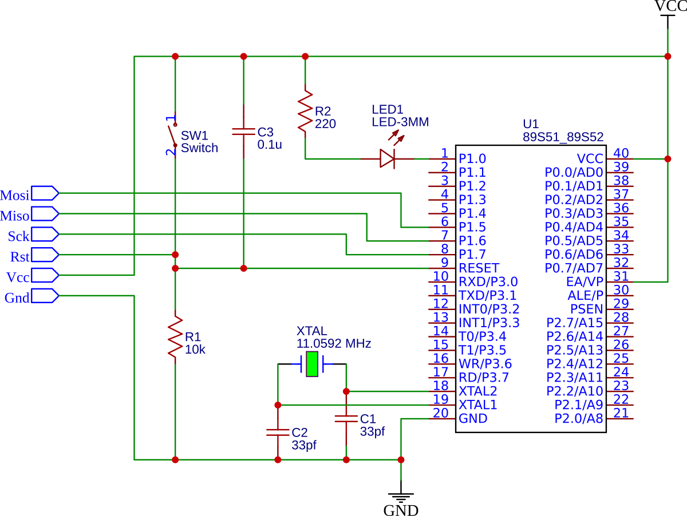
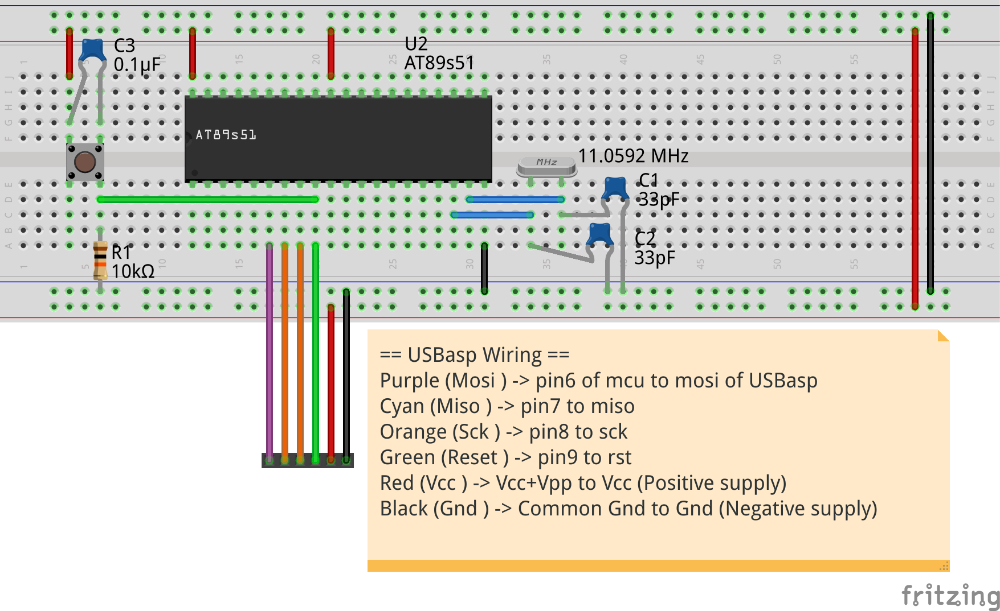
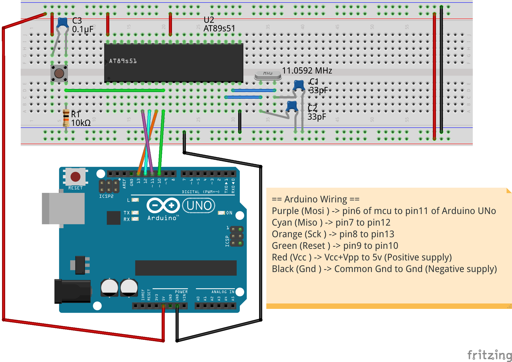

# Ardu51
This repository is all about programming an 8051 MCU using Arduino/USBasp and three open-source software packages. You can also watch my YouTube video on this project [here.](https://www.youtube.com/watch?v=JS8DiOXi0m8&t=173s)

| Sno.   | Software | Source| 
| :----------- | :------------- | :-- |
| 1 | Arduino IDE | [Arduino IDE Download page](https://www.arduino.cc/en/Main/Software) |
| 2 | SDCC |[SDCC Download page](https://sourceforge.net/projects/sdcc/files/) |
| 3 | Avr Dude | [Ladyada AVR Setup guide](http://ladyada.net/learn/avr/index.html) |

All of the programs above are open-source and provided by most of the Linux distribution from their repositories, you can install them using the software store OR by using the package manager of your respective Linux distribution.

# Schematic Diagram

# USBasp Wiring

# Arduino Wiring

